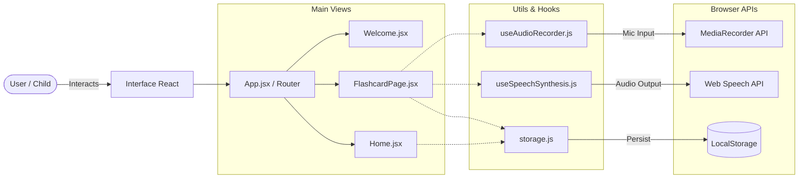

# 🏗️ TalkPlay - Architecture & Technical Design

This document provides a overview of the **TalkPlay** architecture, design decisions, and data flow. It is intended for developers and stakeholders to understand the inner workings of the application.

## 1. 💻 System Overview  
TalkPlay is a **Client-Side Single Page Application (SPA)** built with React.  
The application operates entirely within the user's browser (Client-Side), ensuring low latency, privacy, and offline capabilities.

* **Architecture Pattern:** Component-Based Architecture.
* **Backend:** None (Serverless/Static).
* **Data Persistence:** Browser `LocalStorage`.
* **Media Processing:** Native Web APIs (SpeechSynthesis & MediaRecorder).

### 🧩 Diagram

